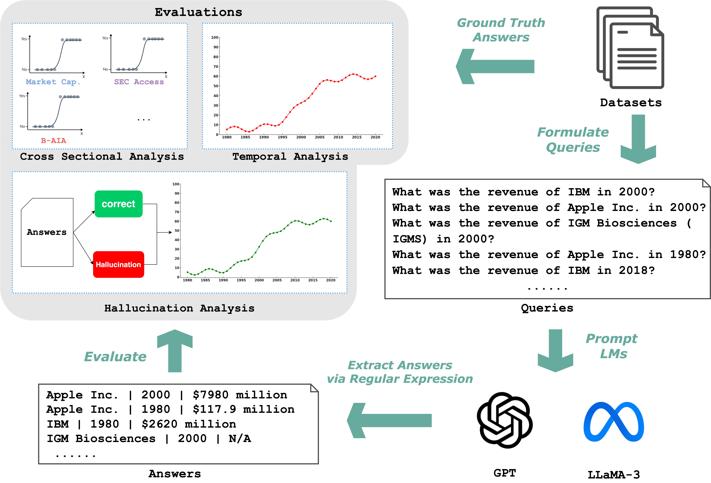
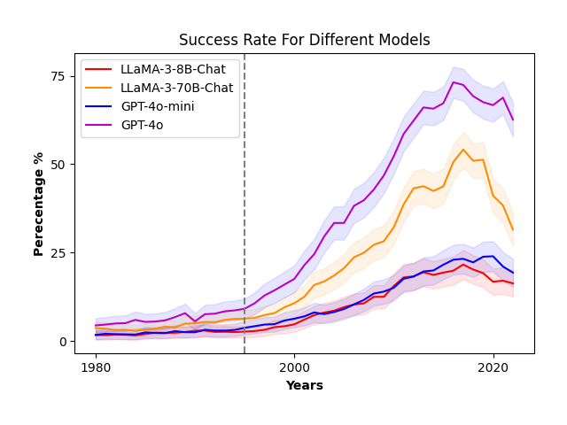

# Beyond the Reported Cutoff: Where Large Language Models Fall Short on Financial Knowledge

**Authors:** Agam Shah, Liqin Ye, Sebastian Jaskowski, Wei Xu, Sudheer Chava  
**arXiv:** [Link](https://arxiv.org/abs/2504.00042)
---

## Key Findings

 - Temporal gap: 54% accuracy in 2017 vs. 6% in 1995, despite data availability on SEC EDGAR 
 - Size bias: A ten‑fold increase in market cap ⇒ +1.01 log‑odds of correct revenue recall
 - Hallucination paradox: Models most accurate on large/recent firms also hallucinate more there

---
## Experiment Pipeline

<p align="center">
  
</p>

## Success Rate Results

<p align="center">
  
</p> 


## Citation

```bibtex
@article{shah2025beyond,
  title={Beyond the Reported Cutoff: Where Large Language Models Fall Short on Financial Knowledge},
  author={Shah, Agam and Ye, Liqin and Jaskowski, Sebastian and Xu, Wei and Chava, Sudheer},
  journal={arXiv preprint arXiv:2504.00042},
  year={2025}
}
```

## Contact

Please raise issue on GitHub or contact Agam Shah (ashah482[at]gatech[dot]edu) for any issues and questions.  
GitHub: [@shahagam4](https://github.com/shahagam4) 